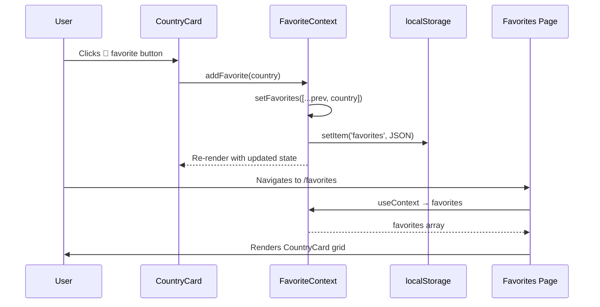
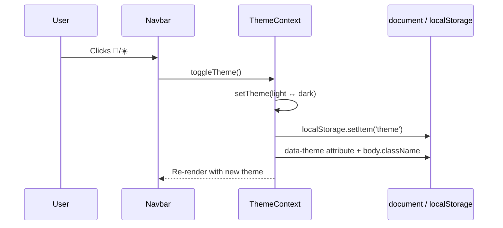

# Travel Explorer — Complete Project Report & Technical Documentation

> **Project:** Travel Explorer  
> **Type:** Single Page Application (SPA)  
> **Stack:** React 19 + Vite 8 + React Router 6 + Context API  
> **External APIs:** REST Countries v3.1, DummyJSON  

---

## Table of Contents

1. [Executive Summary](#1-executive-summary)
2. [Project Structure](#2-project-structure)
3. [Application Bootstrap Flow](#3-application-bootstrap-flow)
4. [Routing Architecture](#4-routing-architecture)
5. [Context API — Complete Workflow](#5-context-api--complete-workflow)
6. [API Service Layer](#6-api-service-layer)
7. [Data Flow Diagrams](#7-data-flow-diagrams)
8. [Component-by-Component Analysis](#8-component-by-component-analysis)
9. [Import / Export Reference Map](#9-import--export-reference-map)
10. [State Management Patterns](#10-state-management-patterns)
11. [Styling Architecture](#11-styling-architecture)
12. [Error Handling & Fallbacks](#12-error-handling--fallbacks)
13. [How to Run the Project](#13-how-to-run-the-project)
14. [Learning Outcomes Demonstrated](#14-learning-outcomes-demonstrated)

---

## 1. Executive Summary

**Travel Explorer** is a React-based travel discovery app that lets users browse countries worldwide, view detailed country information, save favorites, search/filter by region, toggle dark/light themes, and view demo user profiles.

The app follows a **layered frontend architecture**:

```
main.jsx → App.jsx → Providers (Router, Theme, Favorites) → AppRoutes → Pages → Components
                                                                              ↓
                                                                        services/api.js → External APIs
```

**Key design decisions:**
- **No backend server** — all data comes from third-party REST APIs via the browser `fetch` API
- **Global state** managed with React Context API (theme + favorites), not Redux
- **Local persistence** via `localStorage` for theme and favorites
- **Client-side routing** via React Router (no full page reloads)
- **Centralized API layer** in `src/services/api.js` — pages never call `fetch` directly

---

## 2. Project Structure

```
TravelExplorer/
└── Travel/
    ├── index.html              # HTML shell — mounts React at #root
    ├── package.json            # Dependencies & scripts
    ├── vite.config.js          # Vite bundler config
    └── src/
        ├── main.jsx            # React entry point
        ├── App.jsx             # Root component — wraps providers
        ├── App.css             # Page & component styles
        ├── index.css           # Global CSS variables & resets
        │
        ├── context/            # Global state (Context API)
        │   ├── ThemeContext.jsx
        │   └── FavoriteContext.jsx
        │
        ├── routes/
        │   └── AppRoutes.jsx   # All route definitions
        │
        ├── pages/              # Route-level screen components
        │   ├── Home.jsx
        │   ├── Countries.jsx
        │   ├── CountryDetails.jsx
        │   ├── Favorites.jsx
        │   ├── UserProfile.jsx
        │   └── About.jsx
        │
        ├── components/         # Reusable UI building blocks
        │   ├── Navbar.jsx
        │   ├── Footer.jsx
        │   ├── CountryCard.jsx
        │   └── SearchBar.jsx
        │
        └── services/
            └── api.js          # All external API calls
```

### Folder Responsibilities

| Folder | Responsibility |
|--------|----------------|
| `context/` | Create, provide, and export React contexts for app-wide state |
| `routes/` | Define URL-to-page mappings using React Router |
| `pages/` | Full-screen views tied to routes; fetch data, manage local state |
| `components/` | Reusable UI pieces used across multiple pages |
| `services/` | Isolated API logic — single source of truth for HTTP calls |

---

## 3. Application Bootstrap Flow

### Step-by-step startup sequence

```
index.html
    └── loads /src/main.jsx
            └── createRoot(#root).render(<StrictMode><App /></StrictMode>)
                    └── App.jsx wraps everything in providers
                            └── AppRoutes renders Navbar + Routes + Footer
```

### `main.jsx` — Entry Point

```jsx
import { StrictMode } from 'react'
import { createRoot } from 'react-dom/client'
import './index.css'
import App from './App.jsx'

createRoot(document.getElementById('root')).render(
  <StrictMode>
    <App />
  </StrictMode>,
)
```

- **`createRoot`** — React 18+ concurrent rendering API
- **`StrictMode`** — runs extra checks in development (double-invokes effects)
- Loads global styles from `index.css` before the app

### `App.jsx` — Provider Composition (Critical)

```jsx
function App() {
  return (
    <Router>                    {/* 1. Enables routing everywhere */}
      <ThemeProvider>           {/* 2. Theme available to all children */}
        <FavoriteProvider>      {/* 3. Favorites available to all children */}
          <AppRoutes />         {/* 4. Actual page content */}
        </FavoriteProvider>
      </ThemeProvider>
    </Router>
  );
}
```

**Provider nesting order matters:**
1. `Router` must wrap anything using `Link`, `useNavigate`, `useParams`, etc.
2. `ThemeProvider` and `FavoriteProvider` must wrap any component that calls `useContext(ThemeContext)` or `useContext(FavoriteContext)`
3. `AppRoutes` is inside all providers, so Navbar, pages, and components can access both contexts

---

## 4. Routing Architecture

### Route definitions (`src/routes/AppRoutes.jsx`)

| URL Path | Component | Purpose | Dynamic Params |
|----------|-----------|---------|----------------|
| `/` | `Home` | Landing page with hero + featured countries | — |
| `/countries` | `Countries` | Full country list with search & region filter | Query: `?search=term` |
| `/country/:code` | `CountryDetails` | Detailed view for one country | `code` = ISO alpha-2 (e.g. `IN`, `US`) |
| `/favorites` | `Favorites` | Saved favorite countries | — |
| `/user/:id` | `UserProfile` | Demo user profile from DummyJSON | `id` = user ID (e.g. `1`) |
| `/about` | `About` | Static project information | — |

### Layout structure

```
AppRoutes
├── Navbar          ← Always visible (uses ThemeContext)
├── <Routes>        ← Only the matched page renders here
│   ├── Home
│   ├── Countries
│   ├── CountryDetails
│   ├── Favorites
│   ├── UserProfile
│   └── About
└── Footer          ← Always visible
```

### React Router hooks used in the project

| Hook | Used In | Purpose |
|------|---------|---------|
| `BrowserRouter` (as `Router`) | `App.jsx` | HTML5 history-based routing |
| `Routes` / `Route` | `AppRoutes.jsx` | Declarative route config |
| `Link` | `Navbar`, `CountryCard` | Client-side navigation (no reload) |
| `useNavigate` | `Home`, `Countries`, `CountryDetails`, `Favorites`, `UserProfile` | Programmatic navigation |
| `useParams` | `CountryDetails`, `UserProfile` | Read `:code` and `:id` from URL |
| `useSearchParams` | `Countries` | Read `?search=` query string from URL |

### Navigation flow examples

**Example 1 — Home search → Countries page**
```
User types "India" in Home SearchBar
  → handleSearch("India") in Home.jsx
  → navigate(`/countries?search=India`)
  → Countries page mounts
  → useSearchParams reads search=India
  → filterCountries filters list client-side
```

**Example 2 — Click country card → Details page**
```
User clicks CountryCard link
  → <Link to={`/country/${country.cca2}`}>  (e.g. /country/IN)
  → CountryDetails mounts
  → useParams() returns { code: "IN" }
  → fetchCountryByCode("IN") called in useEffect
```

**Example 3 — Navbar profile link**
```
User clicks 👤 in Navbar
  → <Link to="/user/1">
  → UserProfile mounts with id=1
  → fetchUserById(1) from DummyJSON API
```

---

## 5. Context API — Complete Workflow

The project uses **two separate contexts**. Each follows the same pattern:

```
createContext() → Provider component → export context + provider → consume with useContext()
```

### 5.1 ThemeContext

**File:** `src/context/ThemeContext.jsx`

#### Exports
| Export | Type | Used By |
|--------|------|---------|
| `ThemeContext` | React Context object | `Navbar.jsx` (via `useContext`) |
| `ThemeProvider` | React component | `App.jsx` |

#### State & API exposed to consumers
```js
{
  theme: 'light' | 'dark',
  toggleTheme: () => void
}
```

#### Lifecycle

```
Mount ThemeProvider
    │
    ├─ useEffect #1 (on mount)
    │     ├─ Read localStorage.getItem('theme')
    │     ├─ If found → setTheme(stored)
    │     └─ Else → check window.matchMedia('prefers-color-scheme: dark')
    │
    └─ useEffect #2 (when theme changes)
          ├─ localStorage.setItem('theme', theme)
          ├─ document.documentElement.setAttribute('data-theme', theme)
          └─ document.body.className = theme
```

#### Where it is imported

```jsx
// PROVIDER — wrap app (export FavoriteProvider)
import { ThemeProvider } from './context/ThemeContext';  // App.jsx

// CONSUMER — read theme state
import { ThemeContext } from '../context/ThemeContext';   // Navbar.jsx
const { theme, toggleTheme } = useContext(ThemeContext);
```

#### Consumer: Navbar.jsx
- Applies `className={`navbar ${theme}`}` for theme-specific styling
- Theme toggle button calls `toggleTheme()` — switches light ↔ dark

---

### 5.2 FavoriteContext

**File:** `src/context/FavoriteContext.jsx`

#### Exports
| Export | Type | Used By |
|--------|------|---------|
| `FavoriteContext` | React Context object | `CountryCard`, `CountryDetails`, `Favorites` |
| `FavoriteProvider` | React component | `App.jsx` |

#### State & API exposed to consumers
```js
{
  favorites: Array<CountryObject>,
  addFavorite: (country) => void,
  removeFavorite: (countryCode) => void,
  isFavorite: (countryCode) => boolean,
  clearFavorites: () => void
}
```

#### Lifecycle

```
Mount FavoriteProvider
    │
    ├─ useEffect #1 (on mount)
    │     └─ Read localStorage.getItem('favorites') → JSON.parse → setFavorites
    │
    ├─ useEffect #2 (when favorites change)
    │     └─ localStorage.setItem('favorites', JSON.stringify(favorites))
    │
    └─ Methods
          ├─ addFavorite(country)    — adds if cca2 not already present
          ├─ removeFavorite(code)    — filters out by cca2
          ├─ isFavorite(code)        — checks existence
          └─ clearFavorites()        — sets empty array
```

#### Where it is imported

```jsx
// PROVIDER
import { FavoriteProvider } from './context/FavoriteContext';  // App.jsx

// CONSUMERS
import { FavoriteContext } from '../context/FavoriteContext';

// CountryCard.jsx    → addFavorite, removeFavorite, favorites
// CountryDetails.jsx → addFavorite, removeFavorite, favorites
// Favorites.jsx      → favorites (read-only display)
```

#### Data shape stored in favorites

Each favorite is a **full country object** from the REST Countries API, keyed by `cca2` (2-letter country code):

```js
{
  name: { common: "India", official: "Republic of India" },
  cca2: "IN",
  region: "Asia",
  capital: ["New Delhi"],
  population: 1417173173,
  flag: "🇮🇳",
  // ... other API fields
}
```

---

### 5.3 Context API Flow Diagram

```
                    App.jsx
                       │
         ┌─────────────┴─────────────┐
         │                           │
   ThemeProvider              FavoriteProvider
         │                           │
    value={{ theme,              value={{ favorites,
            toggleTheme }}               addFavorite,
         │                             removeFavorite,
         │                             isFavorite,
         │                             clearFavorites }}
         │                           │
         └───────────┬───────────────┘
                     │
                 AppRoutes
                     │
      ┌──────────────┼──────────────┐
      │              │              │
   Navbar      CountryCard    CountryDetails
 useContext    useContext       useContext
(ThemeCtx)   (FavoriteCtx)   (FavoriteCtx)
                     │
                 Favorites
               useContext
              (FavoriteCtx)
```

### 5.4 Rules for adding a new context

If you extend this project with a new global context (e.g. `AuthContext`):

1. **Create** `src/context/YourContext.jsx`
2. **Export** both `YourContext` and `YourProvider`
3. **Wrap** in `App.jsx` inside existing providers:
   ```jsx
   <ThemeProvider>
     <FavoriteProvider>
       <YourProvider>
         <AppRoutes />
       </YourProvider>
     </FavoriteProvider>
   </ThemeProvider>
   ```
4. **Consume** in any child component:
   ```jsx
   import { YourContext } from '../context/YourContext';
   const value = useContext(YourContext);
   ```

---

## 6. API Service Layer

**File:** `src/services/api.js`  
**Role:** Single abstraction over all HTTP communication. Pages import named functions — they never construct URLs themselves.

### External API endpoints

| Base URL | Provider | Used For |
|----------|----------|----------|
| `https://restcountries.com/v3.1` | REST Countries | Country data |
| `https://dummyjson.com` | DummyJSON | Demo user profiles |

### Exported functions

#### `fetchAllCountries()`
```
GET https://restcountries.com/v3.1/all
```
- **Returns:** `Array<Country>`
- **Used by:** `Home.jsx`, `Countries.jsx`
- **On error:** Falls back to `getMockCountries()` (6 hardcoded countries)
- **Normalization:** Wraps single object in array if API returns non-array

#### `fetchCountryByCode(code)`
```
GET https://restcountries.com/v3.1/alpha/{CODE}
```
- **Parameter:** ISO alpha-2 code (e.g. `"in"` → uppercased to `"IN"`)
- **Returns:** `Array<Country>` (always array; pages take `[0]`)
- **Used by:** `CountryDetails.jsx`
- **Fallback chain on error:**
  1. Call `fetchAllCountries()` and filter by `cca2`
  2. Filter `getMockCountries()` by `cca2`
  3. Re-throw error if nothing found

#### `fetchCountriesByRegion(region)`
```
GET https://restcountries.com/v3.1/region/{region}
```
- **Returns:** `Array<Country>` filtered by region
- **Used by:** Currently **not used** by any page (Countries.jsx filters client-side instead)
- **On error:** Filters mock data by region

#### `fetchAllUsers()`
```
GET https://dummyjson.com/users
```
- **Returns:** `data.users` array
- **Used by:** Currently **not used** by any page (available for future use)

#### `fetchUserById(userId)`
```
GET https://dummyjson.com/users/{userId}
```
- **Returns:** Single user object
- **Used by:** `UserProfile.jsx`
- **On error:** Throws (no mock fallback)

### API call pattern used in every page

Every data-fetching page follows this identical pattern:

```jsx
const [data, setData] = useState(null);
const [loading, setLoading] = useState(true);
const [error, setError] = useState(null);

useEffect(() => {
  const loadData = async () => {
    try {
      setLoading(true);
      const result = await fetchSomeApi();
      setData(result);
    } catch (err) {
      setError('Failed to load...');
      console.error(err);
    } finally {
      setLoading(false);
    }
  };
  loadData();
}, [dependency]);
```

### Who calls which API function

| Page | API Function | Trigger |
|------|-------------|---------|
| `Home` | `fetchAllCountries` | On mount |
| `Countries` | `fetchAllCountries` | On mount |
| `CountryDetails` | `fetchCountryByCode(code)` | On mount + when `code` param changes |
| `UserProfile` | `fetchUserById(id)` | On mount + when `id` param changes |
| `Favorites` | *(none)* | Reads from FavoriteContext |
| `About` | *(none)* | Static content |

---

## 7. Data Flow Diagrams

### 7.1 Country browsing flow

```mermaid
sequenceDiagram
    participant User
    participant Home
    participant API as api.js
    participant RC as REST Countries API
    participant Countries
    participant Card as CountryCard
    participant Details as CountryDetails

    User->>Home: Opens app (/)
    Home->>API: fetchAllCountries()
    API->>RC: GET /v3.1/all
    RC-->>API: JSON array
    API-->>Home: countries[]
    Home->>Home: slice(0,6) → featured

    User->>Home: Searches "Japan"
    Home->>Countries: navigate(/countries?search=Japan)
    Countries->>API: fetchAllCountries()
    API-->>Countries: countries[]
    Countries->>Countries: filter by search + region

    User->>Card: Clicks country card
    Card->>Details: navigate(/country/JP)
    Details->>API: fetchCountryByCode("JP")
    API->>RC: GET /v3.1/alpha/JP
    RC-->>API: country data
    API-->>Details: [country]
    Details->>User: Renders full details
```

### 7.2 Favorites flow



### 7.3 Theme toggle flow



---

## 8. Component-by-Component Analysis

### 8.1 Pages

#### `Home.jsx` — Landing Page
| Aspect | Detail |
|--------|--------|
| **Route** | `/` |
| **API** | `fetchAllCountries()` on mount |
| **Local state** | `countries`, `featured` (first 6), `loading`, `error` |
| **Context** | None |
| **Child components** | `SearchBar`, `CountryCard` |
| **Key behavior** | Search redirects to `/countries?search=term` via `useNavigate` |
| **Sections** | Hero, Featured Countries grid, Popular Destinations (static), CTA button |

#### `Countries.jsx` — Browse & Filter
| Aspect | Detail |
|--------|--------|
| **Route** | `/countries` |
| **API** | `fetchAllCountries()` on mount |
| **URL params** | `?search=` via `useSearchParams` |
| **Local state** | `countries`, `filteredCountries`, `loading`, `error`, `selectedRegion` |
| **Filtering** | Client-side: by name (case-insensitive) + by region dropdown |
| **Regions** | all, Africa, Americas, Asia, Europe, Oceania |
| **Child components** | `SearchBar`, `CountryCard` |

#### `CountryDetails.jsx` — Single Country View
| Aspect | Detail |
|--------|--------|
| **Route** | `/country/:code` |
| **API** | `fetchCountryByCode(code)` — re-fetches when `code` changes |
| **Context** | `FavoriteContext` — add/remove favorites |
| **URL params** | `code` via `useParams` |
| **Displays** | Flag, name, region, capital, population, area, languages, currency, timezones, borders |
| **Actions** | Back button, Add/Remove favorite button |

#### `Favorites.jsx` — Saved Countries
| Aspect | Detail |
|--------|--------|
| **Route** | `/favorites` |
| **API** | None — reads from context only |
| **Context** | `FavoriteContext` → `favorites` |
| **Child components** | `CountryCard` (reused for each favorite) |
| **Empty state** | Shows message + "Explore Countries" button |
| **Extra UI** | Summary stats table below the grid |

#### `UserProfile.jsx` — Demo User Page
| Aspect | Detail |
|--------|--------|
| **Route** | `/user/:id` |
| **API** | `fetchUserById(id)` |
| **URL params** | `id` via `useParams` |
| **Displays** | Avatar, personal info, address, company, physical details |
| **Note** | Navbar hard-links to `/user/1` |

#### `About.jsx` — Static Info Page
| Aspect | Detail |
|--------|--------|
| **Route** | `/about` |
| **API** | None |
| **Context** | None |
| **Content** | Mission, features, tech stack, data sources, learning outcomes |

---

### 8.2 Components

#### `Navbar.jsx`
| Aspect | Detail |
|--------|--------|
| **Context** | `ThemeContext` → `theme`, `toggleTheme` |
| **Local state** | `isMenuOpen` (mobile hamburger menu) |
| **Navigation** | `Link` to `/`, `/countries`, `/favorites`, `/about`, `/user/1` |
| **Features** | Responsive menu toggle, theme switch button |

#### `Footer.jsx`
| Aspect | Detail |
|--------|--------|
| **Context** | None |
| **Links** | Uses `<a href>` (full navigation) — note: unlike Navbar, these cause full page reload |
| **Sections** | Brand, quick links, API resources, social placeholders |

#### `CountryCard.jsx`
| Aspect | Detail |
|--------|--------|
| **Props** | `country` (object from API) |
| **Context** | `FavoriteContext` → `favorites`, `addFavorite`, `removeFavorite` |
| **Local state** | `isFavorite` (synced on mount from context) |
| **Navigation** | `Link` to `/country/{cca2}` |
| **Actions** | Heart button toggles favorite (prevents link navigation via `e.preventDefault()`) |

#### `SearchBar.jsx`
| Aspect | Detail |
|--------|--------|
| **Props** | `onSearch` (callback), `placeholder` (optional) |
| **Local state** | `searchTerm` |
| **Behavior** | Calls `onSearch(value)` on every keystroke (live search) |
| **Clear button** | Appears when text exists; resets input and calls `onSearch('')` |

---

## 9. Import / Export Reference Map

### Context exports

```
src/context/ThemeContext.jsx
  EXPORT: ThemeContext, ThemeProvider
  IMPORT PROVIDER IN: App.jsx
  IMPORT CONTEXT IN:  Navbar.jsx

src/context/FavoriteContext.jsx
  EXPORT: FavoriteContext, FavoriteProvider
  IMPORT PROVIDER IN: App.jsx
  IMPORT CONTEXT IN:  CountryCard.jsx, CountryDetails.jsx, Favorites.jsx
```

### API exports

```
src/services/api.js
  EXPORT: fetchAllCountries, fetchCountryByCode, fetchCountriesByRegion,
          fetchAllUsers, fetchUserById
  IMPORT IN: Home.jsx, Countries.jsx, CountryDetails.jsx, UserProfile.jsx
```

### Route exports

```
src/routes/AppRoutes.jsx
  EXPORT: default AppRoutes
  IMPORT IN: App.jsx
```

### Component dependency graph

```
App.jsx
├── context/ThemeContext.jsx      (ThemeProvider)
├── context/FavoriteContext.jsx   (FavoriteProvider)
└── routes/AppRoutes.jsx
    ├── components/Navbar.jsx
    │   └── context/ThemeContext.jsx
    ├── components/Footer.jsx
    └── pages/*
        ├── Home.jsx
        │   ├── components/SearchBar.jsx
        │   ├── components/CountryCard.jsx
        │   │   └── context/FavoriteContext.jsx
        │   └── services/api.js
        ├── Countries.jsx
        │   ├── components/SearchBar.jsx
        │   ├── components/CountryCard.jsx
        │   └── services/api.js
        ├── CountryDetails.jsx
        │   ├── context/FavoriteContext.jsx
        │   └── services/api.js
        ├── Favorites.jsx
        │   ├── context/FavoriteContext.jsx
        │   └── components/CountryCard.jsx
        ├── UserProfile.jsx
        │   └── services/api.js
        └── About.jsx
```

---

## 10. State Management Patterns

The project uses **three levels of state**:

### Level 1 — Global state (Context API)
| State | Storage | Persisted |
|-------|---------|-----------|
| Theme (light/dark) | `ThemeContext` | `localStorage['theme']` |
| Favorites list | `FavoriteContext` | `localStorage['favorites']` |

### Level 2 — Page-level state (useState + useEffect)
| Page | State |
|------|-------|
| Home | countries, featured, loading, error |
| Countries | countries, filteredCountries, loading, error, selectedRegion |
| CountryDetails | country, loading, error, isFavorite |
| UserProfile | user, loading, error |

### Level 3 — Component-level state (useState)
| Component | State |
|-----------|-------|
| Navbar | isMenuOpen |
| CountryCard | isFavorite |
| SearchBar | searchTerm |

### State ownership principle

- **Shared across routes** → Context (favorites, theme)
- **Fetched from API, used on one page** → Page-level useState
- **UI-only, local to component** → Component-level useState

---

## 11. Styling Architecture

| File | Scope |
|------|-------|
| `index.css` | CSS variables, global resets, `data-theme` attribute selectors |
| `App.css` | All component and page styles (navbar, cards, grids, hero, etc.) |

**Theme switching mechanism:**
1. `ThemeContext` sets `document.documentElement.setAttribute('data-theme', theme)`
2. `document.body.className = theme`
3. CSS uses `[data-theme="dark"]` or `.dark` class selectors for theme variants

---

## 12. Error Handling & Fallbacks

| Function | Strategy |
|----------|----------|
| `fetchAllCountries` | Catch → return 6 mock countries |
| `fetchCountryByCode` | Catch → try full list filter → try mock filter → throw |
| `fetchCountriesByRegion` | Catch → filter mock data by region |
| `fetchUserById` | Catch → throw (page shows error UI) |
| Context localStorage | try/catch around read/write with console.error |

**Mock countries available as fallback:** India, Japan, USA, France, Australia, Canada

---

## 13. How to Run the Project

```bash
cd Travel
npm install
npm run dev      # Start dev server (Vite)
npm run build    # Production build
npm run preview  # Preview production build
npm run lint     # Run oxlint
```

Open the URL shown in terminal (typically `http://localhost:5173`).

---

## 14. Learning Outcomes Demonstrated

| Concept | Where Demonstrated |
|---------|------------------|
| React Hooks (`useState`, `useEffect`, `useContext`) | All pages and contexts |
| Component composition | `CountryCard`, `SearchBar` reused across pages |
| React Router (SPA routing) | `AppRoutes.jsx`, `Link`, `useNavigate`, `useParams` |
| Context API (global state) | `ThemeContext`, `FavoriteContext` |
| Provider pattern | Nested providers in `App.jsx` |
| API integration (`fetch`) | `services/api.js` |
| Async data loading patterns | Loading/error states in pages |
| URL parameters | `/country/:code`, `/user/:id` |
| Query strings | `/countries?search=term` |
| localStorage persistence | Theme + favorites contexts |
| Client-side filtering | `Countries.jsx` search + region filter |
| Error boundaries & fallbacks | Mock data in API layer |
| Responsive design | CSS + mobile navbar toggle |

---

## Quick Reference Cheat Sheet

```
START APP:     main.jsx → App.jsx → Providers → AppRoutes
ADD ROUTE:     Edit src/routes/AppRoutes.jsx
ADD API CALL:  Add function in src/services/api.js, import in page
ADD CONTEXT:   Create src/context/X.jsx, wrap in App.jsx, useContext in component
NAVIGATE:      <Link to="..."> or useNavigate()()
READ URL PARAM: useParams() or useSearchParams()
GLOBAL STATE:  ThemeContext (theme) | FavoriteContext (saved countries)
DATA SOURCE:   restcountries.com (countries) | dummyjson.com (users)
```

---

*Report generated from full codebase analysis of Travel Explorer.*
